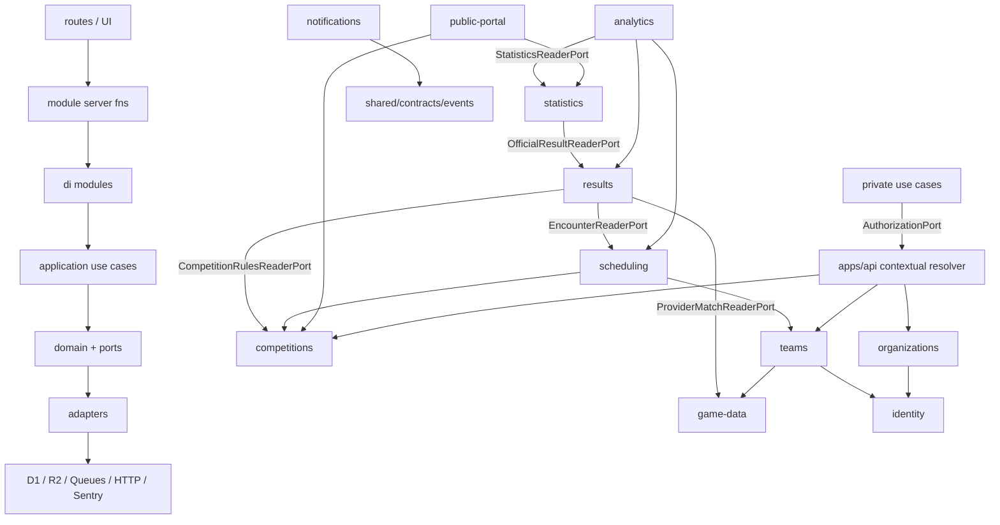
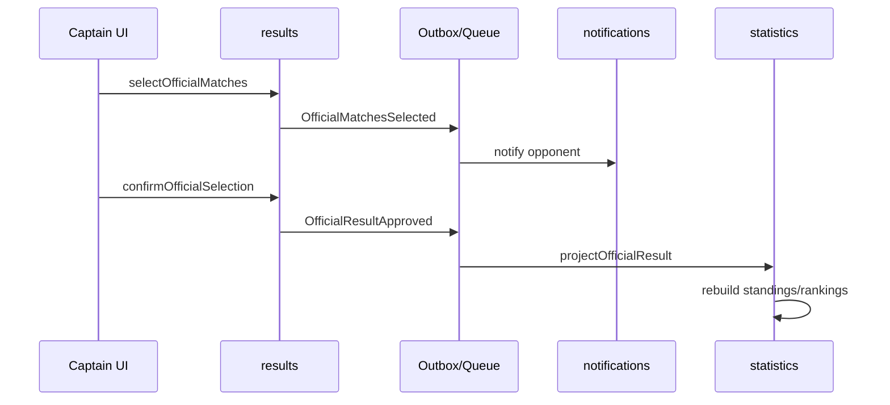
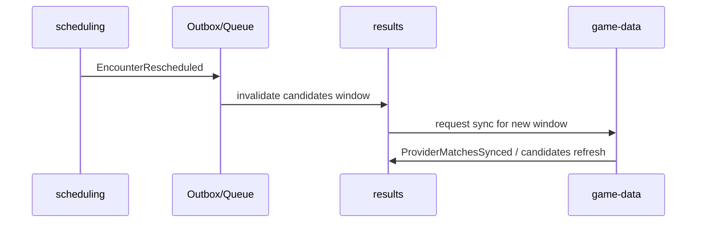

# Grafo de dependencias

Estado: canónico  
Relacionado: [overview](/docs/architecture/overview.md) · [module-boundaries](/docs/architecture/module-boundaries.md)

## Módulos (DAG lógico)

```mermaid
flowchart TD
  Routes["routes / UI"] --> Server["module server fns"]
  Server --> DI["di modules"]
  DI --> AppLayer["application use cases"]
  AppLayer --> Domain["domain + ports"]
  Domain --> Adapters["adapters"]
  Adapters --> CF["D1 / R2 / Queues / HTTP / Sentry"]

  Results["results"] -->|"ProviderMatchReaderPort"| GameData["game-data"]
  Results -->|"EncounterReaderPort"| Scheduling["scheduling"]
  Results -->|"CompetitionRulesReaderPort"| Competitions["competitions"]
  Statistics["statistics"] -->|"OfficialResultReaderPort"| Results
  Analytics["analytics"] -->|"StatisticsReaderPort"| Statistics
  Analytics --> Scheduling
  Analytics --> Results
  Teams["teams"] --> GameData
  Teams --> Identity["identity"]
  Scheduling --> Competitions
  Scheduling --> Teams
  Notifications["notifications"] --> SharedEvents["shared/contracts/events"]
  PublicPortal["public-portal"] --> Statistics
  PublicPortal --> Competitions
  Organizations["organizations"] --> Identity
  PrivateUseCases["private use cases"] -->|"AuthorizationPort"| AuthResolver["apps/api contextual resolver"]
  AuthResolver --> Organizations
  AuthResolver --> Competitions
  AuthResolver --> Teams
```

Los edges entre módulos son **APIs públicas / ports / eventos**, nunca imports de adapters.

## Flujo selection → stats

```mermaid
sequenceDiagram
  participant Cap as Captain UI
  participant Res as results
  participant Out as Outbox/Queue
  participant Ntf as notifications
  participant Stat as statistics

  Cap->>Res: selectOfficialMatches
  Res->>Out: OfficialMatchesSelected
  Out->>Ntf: notify opponent
  Cap->>Res: confirmOfficialSelection
  Res->>Out: OfficialResultApproved
  Out->>Stat: projectOfficialResult
  Stat->>Stat: rebuild standings/rankings
```

## Flujo reschedule → candidatos

```mermaid
sequenceDiagram
  participant Sch as scheduling
  participant Out as Outbox/Queue
  participant Res as results
  participant GD as game-data

  Sch->>Out: EncounterRescheduled
  Out->>Res: invalidate candidates window
  Res->>GD: request sync for new window
  GD->>Res: ProviderMatchesSynced / candidates refresh
```

## Verificación

- Import lint: `domain` sin adapters; `di/` único lugar de concreciones (hoy solo `apps/api/src/di`, ver [ADR-0013](/docs/adr/0013-ea-egress-api-only.md)).
- Tests de dominio sin I/O.
- Application tests con ports fake.
- Adapter tests D1 + fixtures EA sanitizadas.
- Aislamiento two-org.
- Replay de queue/outbox/confirmación.
