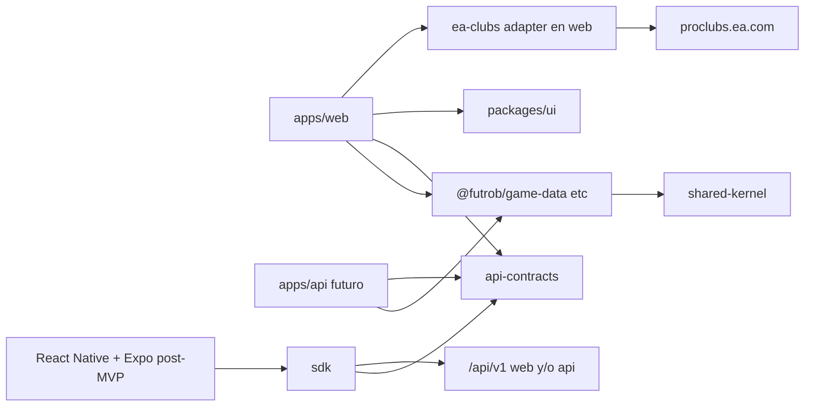

# Packages y SDK

Estado: activo (BC packages + game-data v1 + SDK TypeScript)  
Fecha: 2026-08-18  
Relacionado: [overview](/docs/architecture/overview.md) · [ADR-0001](/docs/adr/0001-monorepo-and-tanstack-start-deployable.md) · [ADR-0002](/docs/adr/0002-hexagonal-feature-modules.md) · [ADR-0005](/docs/adr/0005-typed-private-api.md) · [ADR-0010](/docs/adr/0010-bounded-context-packages.md) · Guía práctica: [`/packages/README.md`](/packages/README.md)

## Objetivo

`packages/` concentra:

1. **Lógica de negocio por BC** (`@futrob/<bc>`: domain + application + ports) compartida por `apps/web` y la futura `apps/api`.
2. **Contratos y clientes HTTP** (`api-contracts`, `sdk`). `@futrob/sdk` cubre web y el cliente móvil post-MVP (React Native + Expo).
3. **Kernel / UI / test-support**.

Adapters de plataforma y UI permanecen en las apps.

## Forma del monorepo

```text
futrob/
├── apps/
│   ├── web/                    # TanStack Start + Workers (UI, BFF, /api/v1 hoy, queues)
│   ├── api/                    # futuro: API de producto (Node); consume @futrob/<bc>
│   └── cli/                    # playground
│
├── packages/
│   ├── identity|organizations|competitions|teams|scheduling|
│   │   game-data|results|statistics|analytics|notifications|public-portal/
│   ├── api-contracts/
│   ├── sdk/
│   ├── ui/
│   ├── shared-kernel/
│   └── test-support/
│
├── product/
└── docs/
```

## Packages de bounded context

Cada `@futrob/<bc>` exporta use cases, entidades, VOs y ports. **No** exporta adapters, schemas Zod de transporte, clientes EA ni bindings.

Cross-BC: solo vía import del package público (ej. `@futrob/results` → `@futrob/game-data`).

## Contratos y SDKs

Sin cambio de rol: `@futrob/api-contracts` + `@futrob/sdk`. El SDK **no** importa `@futrob/<bc>` ni adapters; solo HTTP a `/api/v1`. El cliente móvil previsto es React Native + Expo y reutiliza este SDK TypeScript; no hay espejo Dart/Flutter.

## Relación con apps


```mermaid
flowchart LR
  Web["apps/web"] --> BCs["@futrob/game-data etc"]
  Api["apps/api futuro"] --> BCs
  Web --> Contracts["api-contracts"]
  Api --> Contracts
  Web --> UI["packages/ui"]
  SdkTs["sdk"] --> Contracts
  SdkTs --> ApiV1["/api/v1 web y/o api"]
  Expo["React Native + Expo post-MVP"] --> SdkTs
  BCs --> Kernel["shared-kernel"]
  EaAdapter["ea-clubs adapter en web"] --> EaHttp["proclubs.ea.com"]
  Web --> EaAdapter
```

## Resumen

- **BC packages** = dominio/application compartible.
- **`apps/web`** = deployable Must Cloudflare hoy.
- **`apps/api`** = deployable API de producto (previsto); misma lógica vía packages.
- **Móvil post-MVP** = React Native + Expo; HTTP con `@futrob/sdk`, sin SDK Dart.
- **EA** solo en adapters de app.
